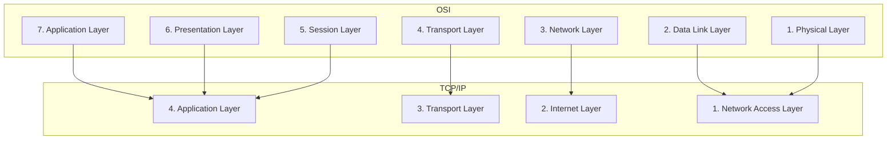

## OSI Model
It is Open System Interconnection, this model was first introduced in the 80s, by ISO (International Organization for Standardization). It outlines what needs to be done from one computer to another, not how it should be done. 
Its just a blueprint that shows how data gets from one computer to another. 
It aides in the standardization of technology in terms of hardware and software.

Serves as an outline for the rules of how protocol is to be used to allow communication between computers. Each layer has it own function 

The seven layers of ISO OSI Reference Model are:
	(a) Physical Layer
	(b) Data Link Layer
	(c) Network Layer
	(d) Transport Layer
	(e) Session Layer
	(f) Presentation Layer
	(g) Application Layer

| Layer | Name         | Function                                                                                                                                                                                                           | Protocols/Standards                            | Data Unit | Examples/Devices                                    |
| ----- | ------------ | ------------------------------------------------------------------------------------------------------------------------------------------------------------------------------------------------------------------ | ---------------------------------------------- | --------- | --------------------------------------------------- |
| 7     | Application  | Provides network services directly to end-users                                                                                                                                                                    | HTTP, FTP, SMTP, POP3, IMAP, DNS, DHCP, telnet | Data      | Web browsers, Email clients, File transfer apps     |
| 6     | Presentation | Data translation, encryption, and compression. Addition of management and security. Standardizing the syntax of application messages.                                                                              | SSL/TLS, JPEG, GIF, MPEG                       | Data      | Format encoders, Encryptors/Decryptors              |
| 5     | Session      | Manages sessions between applications. Defines a connection from a user to a network server or from a peer on a network to another peer. It allows for checkpointing to see if data has arrived to its destination | NetBIOS, RPC, PAP, SSH                         | Data      | Session establishment, maintenance, and termination |
| 4     | Transport    | End-to-end delivery and error control. Manages the flow of information from one network node to another. Ensures that packets are decoded in the proper sequence and received logically                            | TCP, UDP                                       | Segments  | Load balancers, Firewalls                           |
| 3     | Network      | Logical addressing and routing. Defines a standard method for operating between nodes and address the scheme.                                                                                                      | IP, ICMP, IGMP, RIP                            | Packets   | Routers, Layer 3 switches                           |
| 2     | Data Link    | Physical addressing and media access control                                                                                                                                                                       | Ethernet, PPP, Frame Relay, ATM                | Frames    | Switches, Bridges, Network cards                    |
| 1     | Physical     | Transmission of raw bits over physical medium. It specifies the interconnection topologies.                                                                                                                        | RS-232, Ethernet, USB, Bluetooth               | Bits      | Hubs, Repeaters, Cables, Network Interface Cards    |

Key Characteristics of Each Layer:

1. **Physical Layer**
   - Deals with physical transmission media
   - Defines voltage levels, data rates, maximum transmission distances
   - Handles bit-level data transmission

2. **Data Link Layer**
   - Provides error-free data delivery over physical layer
   - Handles addressing at hardware level (MAC addresses)
   - Performs error detection and correction

3. **Network Layer**
   - Handles logical addressing (IP addresses)
   - Performs routing between networks
   - Manages traffic congestion

4. **Transport Layer**
   - Ensures complete data transfer
   - Provides error checking and recovery
   - Handles flow control

5. **Session Layer**
   - Establishes, maintains, and terminates sessions
   - Handles synchronization between tasks
   - Implements checkpointing for long data transfers

6. **Presentation Layer**
   - Translates data between application and network formats
   - Handles data compression and encryption
   - Ensures data is usable by application layer

7. **Application Layer**
   - Provides network services to end-user applications
   - Implements file transfers, email, and other end-user networks
   - Direct interface with user applications
---

## OSI VS TCP/IP Model

Yes, the OSI (Open Systems Interconnection) and TCP/IP models are different, though they serve similar purposes. Here are the key differences:

1. Number of Layers:
	- OSI has 7 layers
	- TCP/IP has 4 layers

2. Development:
	- OSI was developed by ISO as a theoretical model
	- TCP/IP was developed practically, based on the actual Internet protocols

3. Layer Organization:
	- TCP/IP combines the OSI Application, Presentation, and Session layers into one Application layer
	- TCP/IP combines the OSI Physical and Data Link layers into one Network Access layer

4. Protocols:
	- OSI isn't tied to specific protocols
	- TCP/IP is built around TCP and IP protocols specifically

5. Implementation:
	- TCP/IP is more widely used in real-world networks
	- OSI is mainly used as a reference model for understanding network concepts
